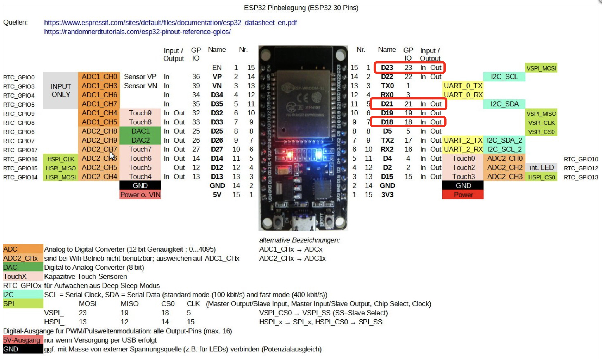

# Configure the Tasmota Lamp device

## Firmware programming using WEB api
https://tasmota.github.io/install/

## Features
- NEO LED strips, all connected to one single gpio
- DHT22 temperature and humidity sensor
- PIR AM312 motion detector

# Pin selection

- D23 PIR DATA
- D21 NEO DATA
- D18 DHT DATA
- 5V DHT22, NEO pixels VCC
- 3.3V PIR VCC
- GND all GNDs

## Change the mode of the seitch, behaviour
```
SwitchMode<x>
```
Switch mode
0 = toggle (default)
1 = follow (0 = off, 1 = on)
2 = inverted follow (0 = on, 1 = off)


## Detatch switches from relais
```
SetOption114
```
When SetOption114 1 all switches are detached from their respective relays and will send MQTT messages instead in the form of {"Switch<x>":{"Action":"<state>"}}.


## Change or define the mqtt publication of a switch
```
Rule1 on Switch1#state=1 do publish std/%topic%/s/pir/state ON endon on Switch1#state=0 do Publish std/%topic%/s/pir/state OFF endon
```

## Configure MQTT

| Setting    | Value                   |
| ---------- | ----------------------- |
| host       | 192.168.178.45          |
| port       | 1883                    |
| Client     | dev4xx                  |
| User       | user                    |
| Password   | pwd                     |
| Topic      | dev4xx                  |
| Full Topic | std/%topic%/s/%prefix%/ |


## Change the brightness or color:
std/dev400/s/stat/RESULT = {"POWER":"ON","Dimmer":78,"Color":"C6A955","HSBColor":"45,57,78","Channel":[78,66,33]}
std/dev400/s/stat/RESULT = {"POWER":"ON","Dimmer":99,"Color":"FCD76D","HSBColor":"45,57,99","Channel":[99,85,43]}