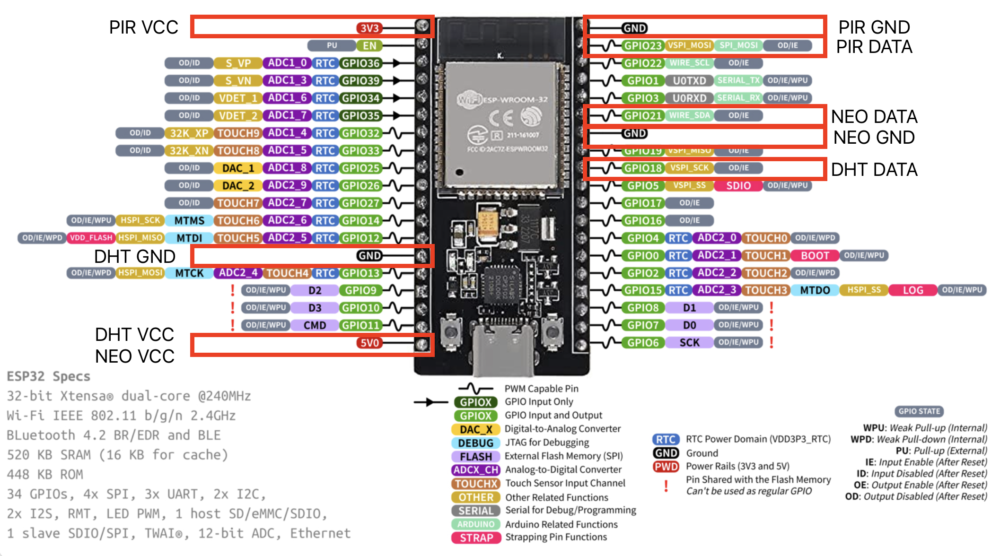

# Build and Configure the Tasmota Lamp device with or w/o Bluetooth

## 3D Printed Housing
**TBD**

## Cabeling the sensors, neopix and ESP32
**TBD**

## Firmware programming using WEB api
https://tasmota.github.io/install/

## Configure Device name
**TBD**


## Configure MQTT

| Setting    | Value                   |
| ---------- | ----------------------- |
| host       | 192.168.178.45          |
| port       | 1883                    |
| Client     | dev4xx                  |
| User       | user                    |
| Password   | pwd                     |
| Topic      | dev4xx                  |
| Full Topic | std/%topic%/s/%prefix%/ |

## Features
- NEO LED strips, all connected to one single gpio
- DHT22 temperature and humidity sensor
- PIR AM312 motion detector

# Pin selection




- D23 PIR DATA
- D21 NEO DATA
- D18 DHT DATA
- 5V DHT22, NEO pixels VCC
- 3.3V PIR VCC
- GND all GNDs

## Change the mode of the switch, behaviour
```
SwitchMode<x>
```
Switch mode
0 = toggle (default)
1 = follow (0 = off, 1 = on)
2 = inverted follow (0 = on, 1 = off)

```
SwitchMode1 1
```

## Detatch switches from relais
```
SetOption114
```

When SetOption114 1 all switches are detached from their respective relays and will send MQTT messages instead in the form of {"Switch<x>":{"Action":"<state>"}}.

```
SetOption114 1
```


## Change or define the mqtt publication of a switch
```
Rule1 on Switch1#state=1 do publish std/%topic%/s/pir/state ON endon on Switch1#state=0 do Publish std/%topic%/s/pir/state OFF endon

Rule1 1
```

Example with turned on rule:
```
04:46:49.141 MQT: std/dev404/s/stat/RESULT = {"Rule1":{"State":"ON","Once":"OFF","StopOnError":"OFF","Length":126,"Free":385,"Rules":"on Switch1#state=1 do publish std/%topic%/s/pir/state ON endon on Switch1#state=0 do Publish std/%topic%/s/pir/state OFF endon"}}

```
Example with turned off rule (see "State":OFF)
```
04:50:00.060 MQT: std/dev406/s/stat/RESULT = {"Rule1":{"State":"OFF","Once":"OFF","StopOnError":"OFF","Length":126,"Free":385,"Rules":"on Switch1#state=1 do publish std/%topic%/s/pir/state ON endon on Switch1#state=0 do Publish std/%topic%/s/pir/state OFF endon"}}
```

## Change the brightness or color:
```
std/dev400/s/stat/RESULT = {"POWER":"ON","Dimmer":78,"Color":"C6A955","HSBColor":"45,57,78","Channel":[78,66,33]}
std/dev400/s/stat/RESULT = {"POWER":"ON","Dimmer":99,"Color":"FCD76D","HSBColor":"45,57,99","Channel":[99,85,43]}
```

## Bluetooth Sensors
### List of Devices and MAC Addresses

| MAC          | Type | Model   | Location             |
| ------------ | ---- | ------- | -------------------- |
| A4C1382E8D23 | ATC  | ATCpvvx | Children Room        |
| 582D343B8C66 | MIJA | Xiaomi  | Parent Sleeping Room |
| 582D343916A7 | MIJA | Xiaomi  | Office               |
| 582D34386437 | MIJA | Xiaomi  | Bathroom 2nd         |
| 582D34371086 | MIJA | Xiaomi  | Bathroom 1st         |

### Enable Bluetooth Sensor readings
1. First select enable bluetooth under bluetooth settings

2. Load the bluetooth files in consoles->file system:
- blerry_driver_XYZ.be according to below model table
- blerry.be

| Type | Model   | driver                   |
| ---- | ------- | ------------------------ |
| ATC  | ATCpvvx | blerry_driver_ATCpvvx.be |
| MIJA | Xiaomi  | blerry_driver_Xiaomi.be  |


1. Load the sensor json configuration, example:
```json
{
   "devices": {
     "582D34371086": {
       "alias": "sensor_xia_firbath",
       "model": "Xiaomi"
     }
   },
   "override": {
     "base_topic": "std/blerry",
     "discovery": true,
     "precision": {
       "Temperature": 1,
       "Humidity": 0,
       "Battery": -1
     }
   },
   "advanced": {
     "old_details": false
   }
 }
```

Enable the bluethooth MQTT transmitting of sensor data:
```
Rule3 on System#Boot DO br load('blerry.be') ENDON

Rule3 1
```
Example with turned on rule:
```
{"Rule3":{"State":"ON","Once":"OFF","StopOnError":"OFF","Length":44,"Free":467,"Rules":"ON System#Boot DO br load('blerry.be') ENDON"}}
```

### Configure HomeAssistant Lovelace for Device view
**TBD**

### Enable automations using appdaemon
**TBD**

### Prepare the LYWSD03MMC/ATC Temperature and Humidity Sensor
Information of the integration can be found here:
[Tasmota - Bluetooth Device Support](https://tasmota.github.io/docs/Bluetooth_ESP32/#supported-devices)

The temperature sensors need to be flashed with a new firmware. This can be done using a web flasher available here:
[WEB FLASHER](https://atc1441.github.io/TelinkFlasher.html)

Firmware binaries are found here:
(Firmware Repo)[https://github.com/atc1441/ATC_MiThermometer/releases]

The configuration in blerry is:
```json
  "devices": {
    "A4C1382E8D23": {
      "alias": "sensor_xia_child",
      "model": "ATCpvvx"
    }
  }

```


